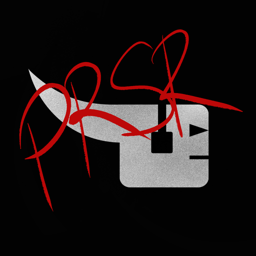
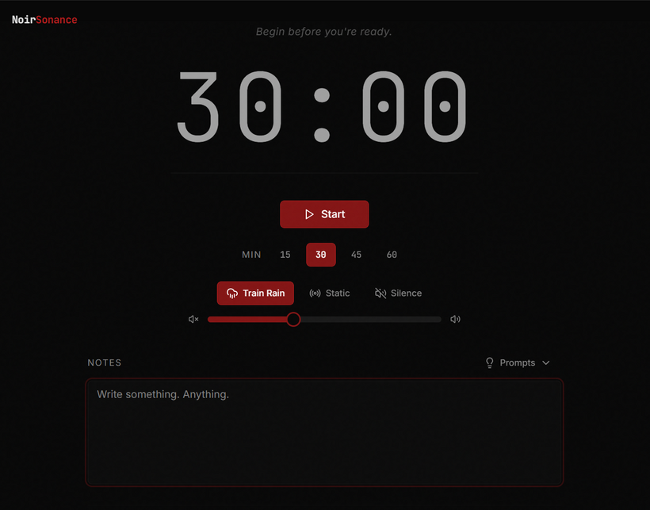
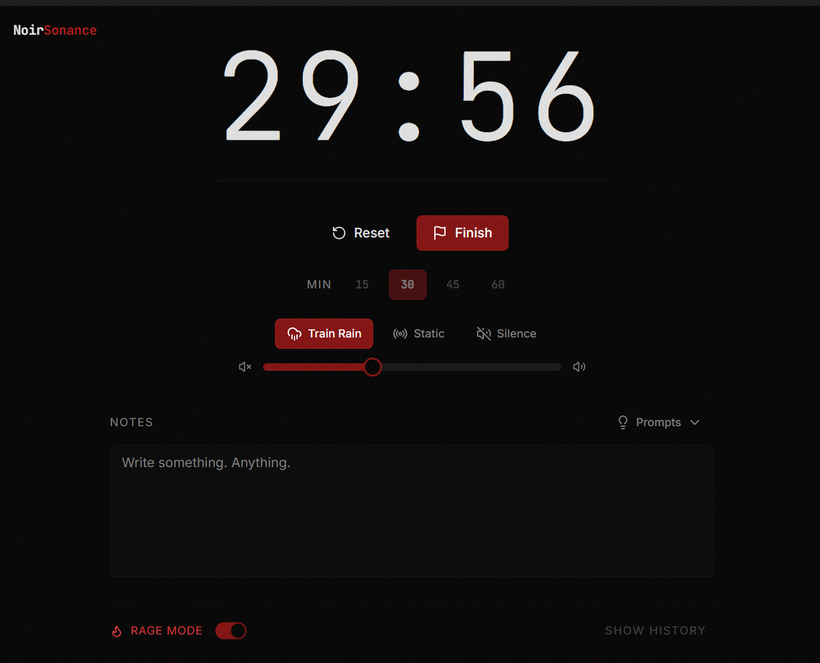

  

<h1 align="center">Creative Pressure</h1>

  <b>A brutal minimalist focus timer for people who make things.</b> 
  Choose a time box, choose silence or a harsh little soundscape, write the smallest possible intention — and work until the pressure lifts.

  <a href="https://github.com/rimedag/creative-pressure/releases/latest"><b>Download for Windows &amp; macOS</b></a> ·
  <a href="#features">Features</a> ·
  <a href="#install">Install</a> ·
  <a href="https://github.com/rimedag/creative-pressure/issues/new/choose">Report a bug</a>

  

## What it does

Creative Pressure is a small desktop ritual machine from NoirSonance for artists,
producers, writers and builders. It is not a productivity dashboard: it is a dark
room, a clock, a note field and a little consequence. Pick a session length and a
soundscape, write down what you are about to do, start the timer and stay in the
session. When it ends, save what happened.

No account, no backend, no telemetry, no cloud sync and no internet connection
required.

  

## Features

- **Timed sessions** — 15, 30, 45 or 60 minute presets with a large monospaced
  countdown.
- **Soundscapes** — Train Rain, Static or Silence, with volume control.
- **Session notes** — a notes field with prompt insertion and autosave.
- **Export ritual** — at the end of a session, copy your notes or download them as
  `.txt` or `.md`.
- **Local history** — the last 30 sessions are kept on your computer.
- **Rage Mode** — removes pause during an active session. Once you start, there is
  no pause.
- **Keyboard control** — Space to start/pause, Escape to leave the completion
  overlay.

## Platform support

| Platform | Status | Download |
|---|---|---|
| Windows 10 / 11 (x64) | ✅ Available | `Creative-Pressure-Windows-x64.exe` |
| macOS 10.13+ (Intel x64; Apple Silicon via Rosetta 2) | ✅ Available | `Creative-Pressure-macOS.app.zip` |
| Linux | Not currently released | — |

## Install

Download your platform's file from the
[latest release](https://github.com/rimedag/creative-pressure/releases/latest). You can
verify downloads against `SHA256SUMS.txt` in the release.

**Windows**

1. Download `Creative-Pressure-Windows-x64.exe`.
2. Run it — Creative Pressure is a single portable executable; there is no installer.

The Windows executable is not code-signed, so SmartScreen may warn on first launch.
Choose **More info → Run anyway** to continue. Creative Pressure uses the Microsoft
Edge WebView2 Runtime, which is preinstalled on Windows 11 and up-to-date Windows 10.

**macOS**

1. Download `Creative-Pressure-macOS.app.zip` and unzip it.
2. Move **Creative Pressure.app** into your **Applications** folder.
3. Launch it from Applications. If macOS blocks the first launch, Control-click the
   app, choose **Open**, then confirm.

## Usage

1. Open Creative Pressure.
2. Pick a session length: 15, 30, 45 or 60 minutes.
3. Choose a soundscape: Train Rain, Static or Silence.
4. Write a note, intention, block, vow or rough idea.
5. Start the timer — optionally in Rage Mode — and stay in the session.
6. When it ends, copy your notes or download them as `.txt` or `.md`.

## Known limitations

- No Linux build is currently released.
- Session history is stored locally on the computer where it was created; there is
  no sync between devices.
- The Windows executable is unsigned (see [Install](#install)).

## Feedback

Found a bug or have an idea? [Open an issue](https://github.com/rimedag/creative-pressure/issues/new/choose).

## License

Creative Pressure is proprietary software, free to download and use. The source code
is not published. See [LICENSE](LICENSE).

---

Made by <a href="https://noirsonance.com/">NoirSonance</a>

